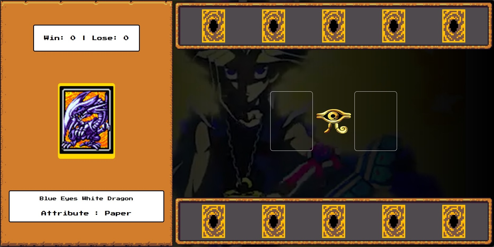

##  🎮 Yu-Gi-Oh | Jo-ken-po Edition  

> #### 🎯 Criando um Jogo de Cartas do Yu-Gi-Oh! com JavaScript e CSS

**📌 Objetivo do desafio:**

Desenvolvimento de um jogo de cartas estilo jo-ken-po com tema do Yu-Gi-Oh utilizando HTML, CSS e JavaScript para o Bootcamp Ri Happy - Front-end do Zero - em parceria com a Dio.

---

> #### 💡 LINGUAGENS UTILIZADAS

- HTML
- CSS
- Javascript

---

> #### 🚨 FERRAMENTAS UTILIZADAS

- VSCode
- Git
- GitHub

---

> #### 🧩 TIPO DE DESAFIO

- Front-End avançado.

---

> #### 🛠️ PROJETO FINAL

---

#### 🏆 Créditos

  - ver mais em <a href="https://github.com/angelicakadja">AK</a>.

