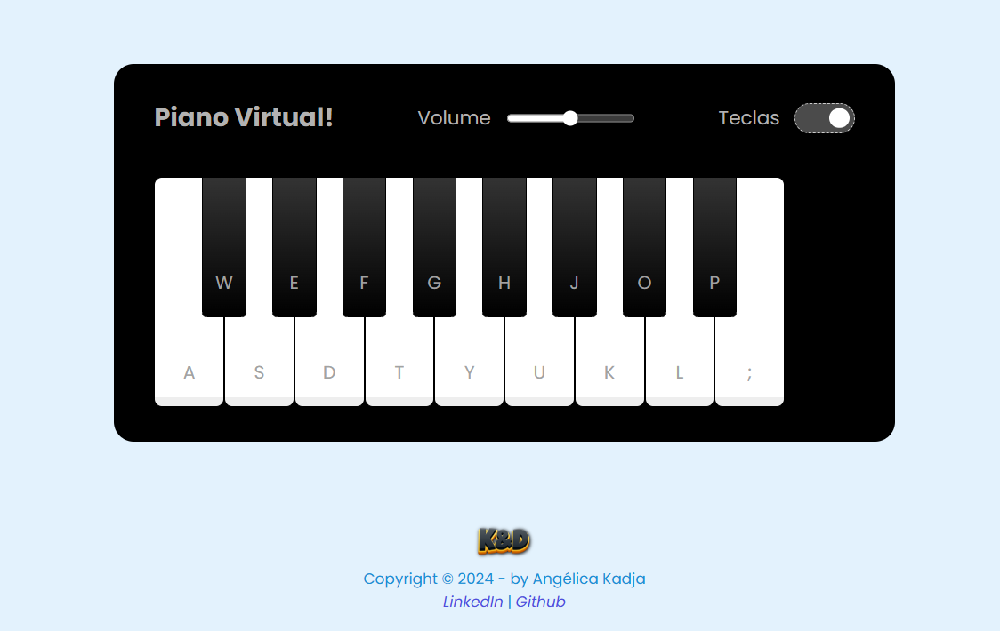

##  🎹 Simulador de Piano  

> ### 🎯 Construindo um Simulador de Piano com JavaScript e CSS

O Piano Simulator é uma aplicação interativa que simula um piano virtual, permitindo que você toque notas musicais com o teclado do computador ou clicando nas teclas virtuais na tela. É uma ferramenta divertida e educacional para explorar sons e melodias.

---

> #### 📌 OBJETIVO DO DESAFIO

- Criar um layout de piano utilizando HTML e CSS.
- Implementar a lógica do piano com JavaScript.
- Utilizar eventos JavaScript para detectar interações do usuário.
- Manipular áudios no navegador para simular o som das teclas do piano.

---

> #### 🤔 FUNCIONALIDADES

- **Toque as teclas**:
  - Use o **mouse** para clicar nas teclas virtuais.
  - Use o **teclado físico** para tocar notas correspondentes.
- **Controle de volume**:
  - Ajuste o volume do som utilizando o controle deslizante.
- **Mostrar/ocultar teclas**:
  - Exiba ou esconda as letras nas teclas usando o checkbox "Teclas".
- **Feedback visual**:
  - Teclas são destacadas quando pressionadas, proporcionando uma experiência interativa.

---

> #### 💡 LINGUAGENS UTILIZADAS

- HTML
- CSS
- Javascript

---

> #### 🛠️ FERRAMENTAS UTILIZADAS

- VSCode
- Git
- GitHub

---

> #### 🧩 TIPO DE DESAFIO

- Front-End intermediário.

---

> #### 🧰 PROJETO FINAL

---

#### 🏆 Créditos

  - ver mais em <a href="https://github.com/angelicakadja">AK</a>.

