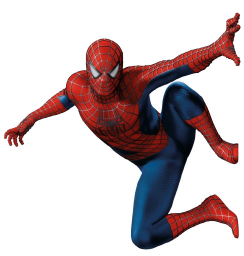

 
  

 ## 🕷️ Multiversos com HTML e CSS   

 

    
    
                  

 

> #### 🎯 DESCRIÇÃO DO PROJETO

- Neste projeto, será explorado o uso dos principais efeitos de CSS, como transições, animações, transformações e estilos avançados, para criar um layout rico e impressionante baseado no universo do Spider-Man.
- Esse projeto vai ensinar técnicas avançadas de posicionamento de elementos em tela, utilizando a sobreposição de blocos e o domínio da arte de compor itens em tela.

---

> #### 📌 OBJETIVO DO DESAFIO

- Criar um site interativo utilizando as tecnologias HTML, CSS e JavaScript, com foco no aprendizado e aplicação dos principais efeitos de CSS.
- O tema do site será o multiverso do Spider-Man, proporcionando uma experiência divertida e envolvente aos usuários.

---

> #### 💡 LINGUAGENS UTILIZADAS

- HTML5: Para a estruturação do conteúdo.
- CSS3: Para estilização e design responsivo.
- JavaScript: Para adicionar interatividade e lógica ao site, incluindo manipulação de dados das versões do Homem-Aranha.

---

> #### 🛠️ FERRAMENTAS UTILIZADAS

- VSCode
- Git
- GitHub

---

> #### 🧩 TIPO DE DESAFIO

- Front-End básico.

---

> #### 🧰 RESULTADO DO PROJETO

  

---

#### 🏆 Créditos

  - ver mais em <a href="https://github.com/angelicakadja">AK</a>.

